<div align="center">
  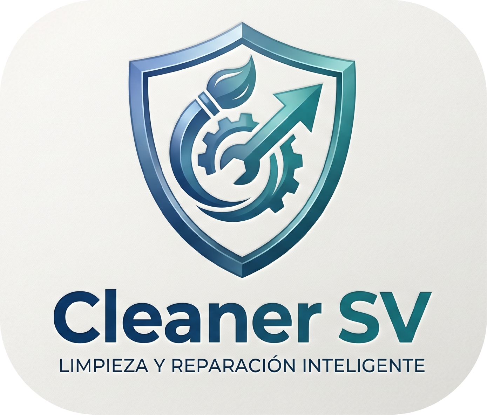
  <h1>🌀 Cleaner Sv</h1>
  <p><strong>Optimización profesional para Windows 11</strong></p>
  <p>
    
    
    
    
  </p>
</div>

---

Cleaner Sv es una aplicación nativa para **Windows 11 (64-bit)** diseñada para optimizar, limpiar, reparar y monitorear el rendimiento del sistema. Interfaz moderna con **Fluent Design**, modo oscuro/claro y gráficos en tiempo real.

---

## 🚀 Características

| Módulo | Descripción |
|--------|------------|
| 🗑️ **Limpieza** | Archivos temporales, caché, logs, miniaturas, papelera, duplicados |
| 📋 **Registro** | Entradas inválidas, claves rotas, DLL faltantes, backup automático |
| 💾 **RAM Optimizer** | Liberación inteligente, modo gaming, top 10 procesos |
| 💿 **Desfragmentador** | Mapa visual de bloques, TRIM para SSD |
| 🔍 **Chequeo de Disco** | Sectores dañados, SMART, temperatura, vida útil SSD |
| ⚡ **Optimización** | Programas de inicio, servicios, modo turbo, red |
| 📈 **Monitor** | CPU, RAM, GPU, disco, temperatura, red en tiempo real |
| 📦 **App Manager** | Desinstalador avanzado con eliminación de residuos |
| 🔐 **Carpeta Segura** | Protección con contraseña, hash SHA256, carpeta oculta |
| 🛡️ **Backup** | Puntos de restauración, backup del registro, historial |

---

## 📷 Galería

<div align="center">
  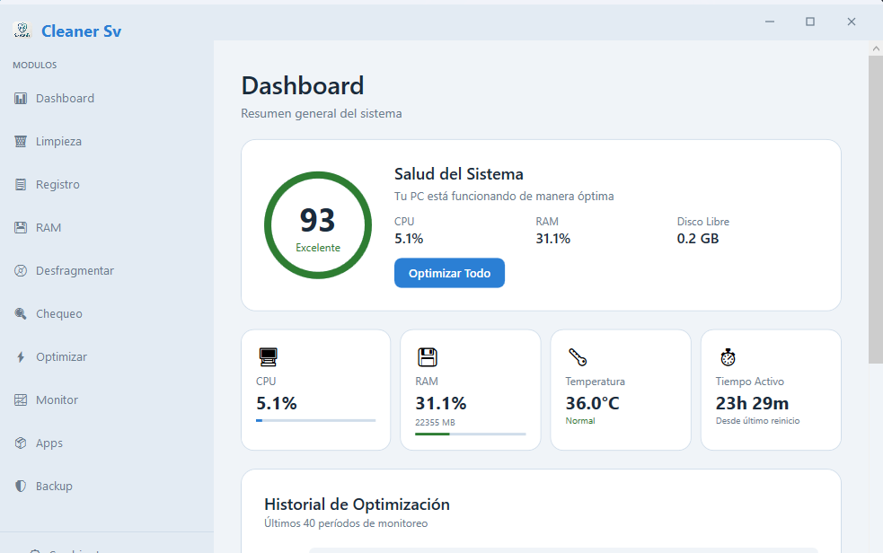
  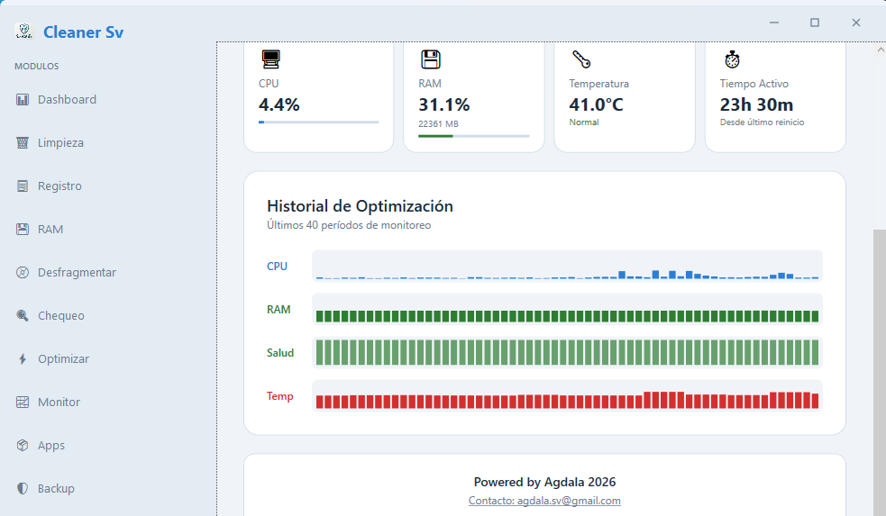
  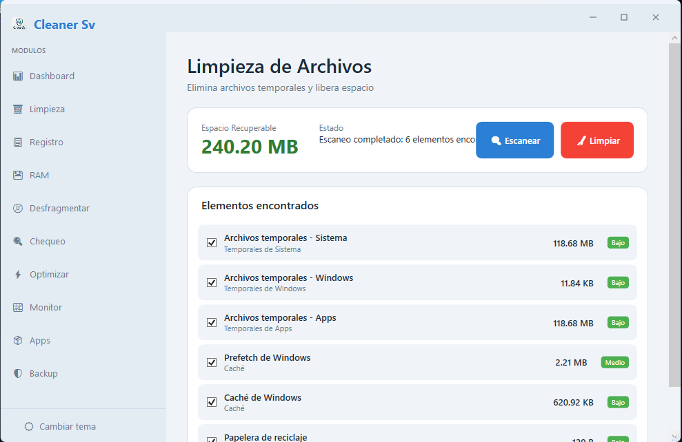
  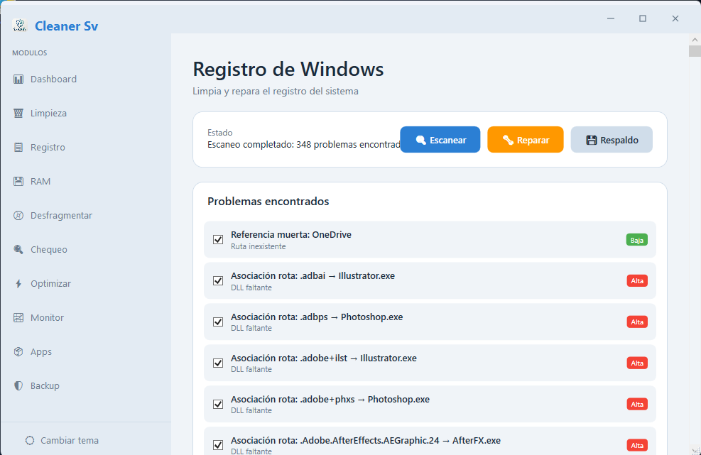
  <br>
  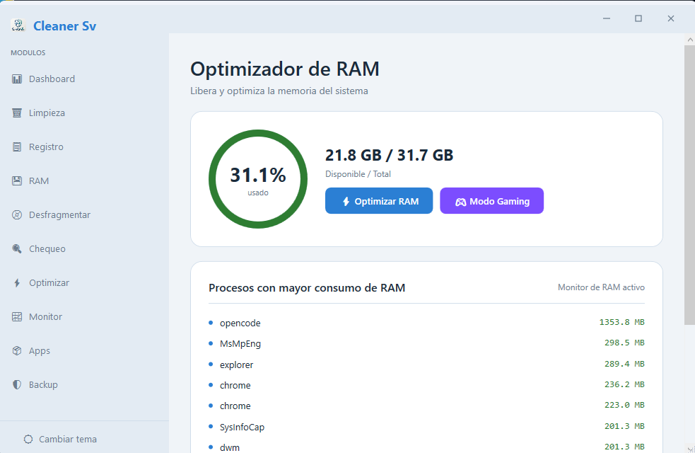
  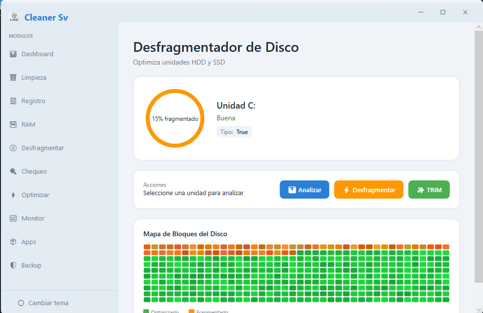
  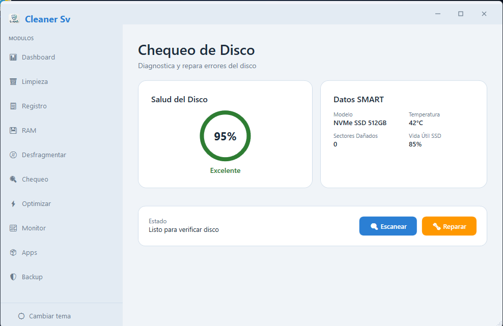
  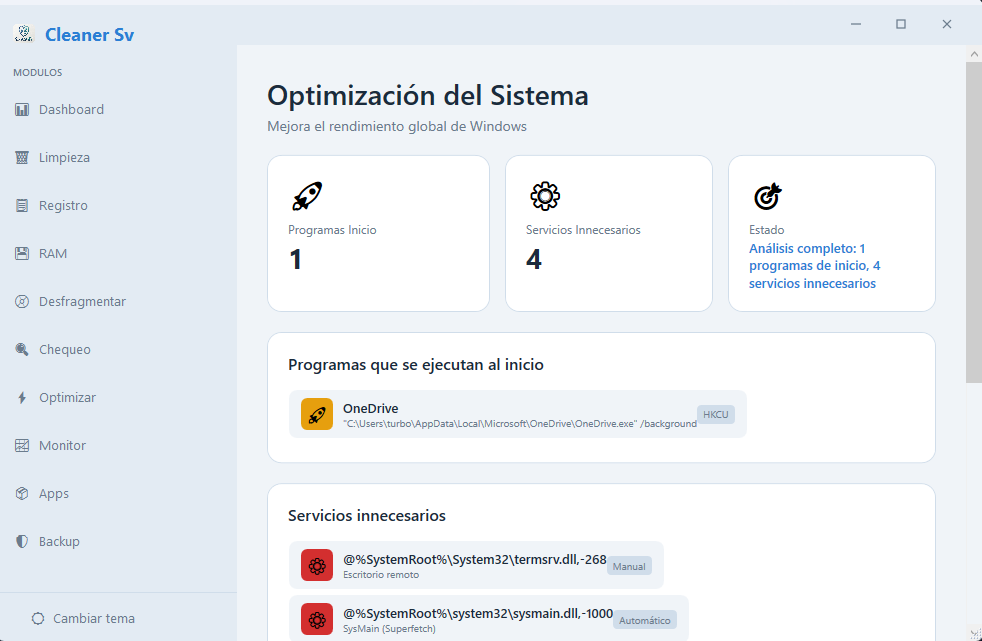
  <br>
  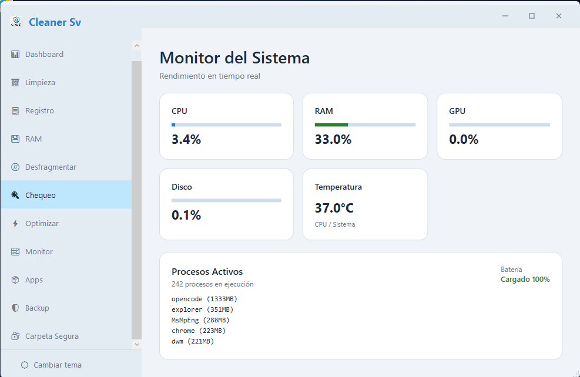
  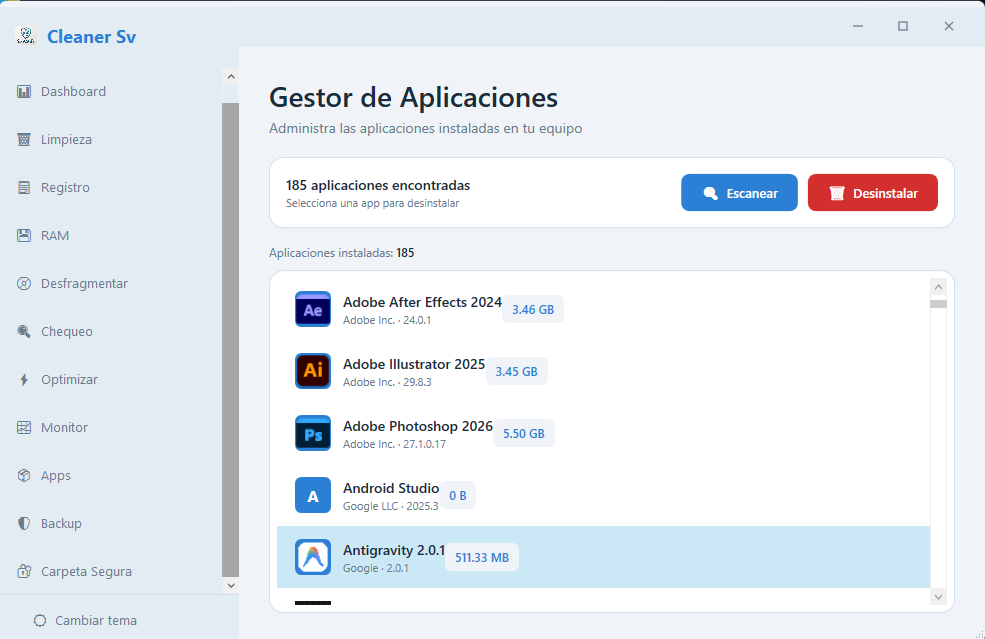
  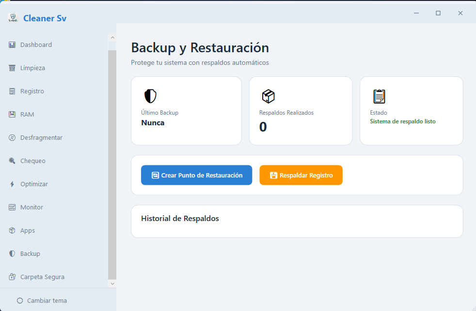
  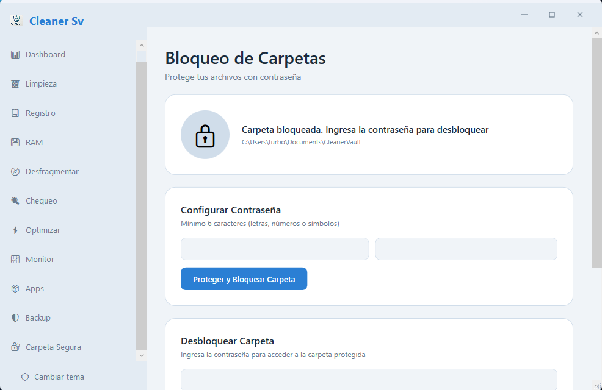
</div>

---

## 🛠️ Tecnologías

| Tecnología | Propósito |
|-----------|-----------|
| **C# / .NET 8** | Lenguaje y framework |
| **WPF** | Interfaz de usuario |
| **Fluent Design** | Diseño visual moderno |
| **LiveChartsCore / SkiaSharp** | Gráficos interactivos |
| **Windows API / WMI** | Info del sistema |
| **WindowsAPICodePack** | Integración shell |
| **WiX Toolset v4** | Instalador MSI |

---

## ⚙️ Requisitos

- **SO:** Windows 11 64-bit
- **Runtime:** .NET 8 Desktop Runtime
- **RAM:** 4 GB mínimo
- **Disco:** 50 MB libres

---

## 📥 Instalación

1. Descarga el instalador desde [Releases](https://github.com/agdalasv/CleanerSv/releases)
2. Ejecuta `CleanerSv.msi`
3. Sigue el asistente de instalación

---

## ☕ Invita un café

Si te gusta el proyecto, apóyame con una donación en BTC:

```
3L8f3v6BWwL7KBcb8AMZQ2bpE3ACne2EUf
```

---

<div align="center">
  <strong>Cleaner Sv</strong> — Todos los derechos reservados <br>
  Powered by <strong>Agdala</strong> &copy; 2026
</div>
